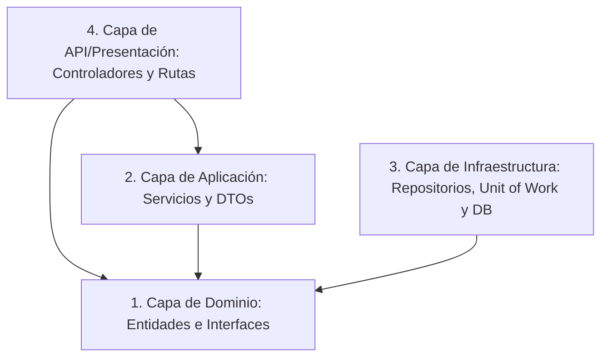

# API de Compañías y Empleados (Laravel + Supabase)

Este proyecto es una API REST construida en Laravel aplicando los patrones **Onion Architecture** (Arquitectura de Cebolla), **Repository Pattern** (Patrón de Repositorios) y **Unit of Work** (Unidad de Trabajo) para la gestión de compañías y sus empleados.

---

## Tecnología Usada
- **Lenguaje**: PHP 8.3+
- **Framework**: Laravel 13.8+
- **Base de Datos**: Supabase (PostgreSQL) para producción/desarrollo y SQLite (:memory:) para la ejecución de pruebas automatizadas.
- **Pruebas**: PHPUnit 12+

---

## ORM Usado
- **Eloquent ORM**: Se utiliza el ORM nativo de Laravel. En el contexto de Onion Architecture, Eloquent se mantiene dentro de la capa de Infraestructura para el mapeo con la base de datos PostgreSQL, mientras que los modelos se manejan como entidades del dominio en la capa central.

---

## Arquitectura Aplicada: Onion Architecture
La solución sigue estrictamente los principios de Onion Architecture, donde las dependencias van hacia el centro y las capas externas no pueden conocer detalles de las capas internas:



### Estructura de Carpetas del Proyecto:
- **`app/Domain/`**: Capa Central. No depende de ningún framework o biblioteca externa.
  - **`Entities/`**: Contiene los modelos de negocio (`Company.php`, `Employee.php`).
  - **`Interfaces/`**: Abstracciones de persistencia (`CompanyRepositoryInterface.php`, `EmployeeRepositoryInterface.php`, `UnitOfWorkInterface.php`).
- **`app/Application/`**: Lógica de Negocio y Casos de Uso. Depende únicamente del Dominio.
  - **`Services/`**: Servicios que coordinan las operaciones (`CompanyService.php`, `EmployeeService.php`).
  - **`DTOs/`**: Objetos de transferencia de datos con validaciones integradas (`CompanyDto.php`, `EmployeeDto.php`).
- **`app/Infrastructure/`**: Implementaciones técnicas del Framework y Base de Datos.
  - **`Repositories/`**: Implementaciones concretas usando Eloquent (`CompanyRepository.php`, `EmployeeRepository.php`).
  - **`UnitOfWork/`**: Manejo de transacciones de base de datos de manera atómica (`UnitOfWork.php`).
- **`app/Http/Controllers/Api/`**: Capa de Presentación. Expone los endpoints REST (`CompanyController.php`, `EmployeeController.php`).
- **`routes/api.php`**: Definición de endpoints REST en español.

---

## Entidades
Las entidades mapeadas en `app/Domain/Entities/` son:

### 1. Compañía (`Company`)
- **`id`**: Llave primaria autoincremental.
- **`name`**: Nombre de la compañía (obligatorio).
- **`address`**: Dirección física (obligatorio).
- **`phone`**: Teléfono de contacto (obligatorio).
- **`created_at` / `updated_at`**: Tiempos de registro.

### 2. Empleado (`Employee`)
- **`id`**: Llave primaria autoincremental.
- **`name`**: Nombre del empleado (obligatorio).
- **`lastname`**: Apellido del empleado (obligatorio).
- **`email`**: Correo electrónico único (obligatorio, formato email).
- **`position`**: Cargo o rol de trabajo (obligatorio).
- **`salary`**: Salario mensual (obligatorio, numérico).
- **`company_id`**: Llave foránea que asocia el empleado a una compañía.

### Relación entre Entidades
- **Compañía (1) ─── (*) Empleado**: Una compañía puede tener muchos empleados y un empleado pertenece a una única compañía. Configurado mediante relaciones Eloquent `hasMany` y `belongsTo` correspondientemente.

---

## Repository Pattern
El patrón repositorio separa la lógica de acceso a datos del resto de la aplicación.
- Las interfaces residen en **`app/Domain/Interfaces/`** para que la lógica de aplicación dependa de abstracciones.
- Las implementaciones concretas residen en **`app/Infrastructure/Repositories/`** y usan Eloquent para consultar e insertar en la base de datos PostgreSQL.
- Los repositorios implementan los siguientes métodos mínimos:
  - `getAll()`: Recupera todos los registros con sus relaciones precargadas (`with`).
  - `getById($id)`: Recupera un registro específico por su identificador único.
  - `create(array $data)`: Registra un nuevo elemento en la base de datos sin confirmación transaccional inmediata si está dentro de un UoW.
  - `update($id, array $data)`: Actualiza las columnas especificadas de un registro.
  - `delete($id)`: Elimina físicamente el elemento por su ID.
  - `findByCondition(array $conditions)`: Permite hacer búsquedas flexibles (ej. filtrar empleados por salario, correo o cargo).

---

## Unit of Work (Unidad de Trabajo)

### ¿Qué es Unit of Work?
Es un patrón de diseño que agrupa múltiples operaciones de base de datos (como inserciones, actualizaciones o eliminaciones en varios repositorios) en una única transacción de base de datos. Garantiza el principio de atomicidad (ACID): o se guardan todos los cambios con éxito, o no se guarda ninguno (todo o nada).

### ¿Cómo se implementó en esta tecnología?
Se implementó mediante una abstracción `UnitOfWorkInterface` en la capa de Dominio y su implementación concreta `UnitOfWork` en la capa de Infraestructura que utiliza la clase `DB` (Database Transactions) de Laravel.

### ¿Cómo se manejan las transacciones?
El servicio inicia una transacción llamando a `beginTransaction()` antes de ejecutar cualquier operación en la base de datos.
- **Inicio de la transacción**: `$this->unitOfWork->beginTransaction()` que ejecuta `DB::beginTransaction()`.
- **Confirmación (Commit)**: Si todas las operaciones se realizan sin problemas, se llama a `$this->unitOfWork->commit()` (`DB::commit()`), persistiendo todos los cambios permanentemente.
- **Reversión (Rollback)**: Si alguna inserción o actualización falla o lanza una excepción, el bloque `catch` atrapa el error y llama a `$this->unitOfWork->rollback()` (`DB::rollBack()`), deshaciendo cualquier escritura intermedia que se haya realizado.

---

## Endpoints REST (en Español)

### Compañías (`/api/companias`)
| Método | Ruta | Descripción | Estado HTTP |
|---|---|---|---|
| **GET** | `/api/companias` | Listar todas las compañías | `200 OK` |
| **GET** | `/api/companias/{id}` | Obtener una compañía por ID | `200 OK` / `404 Not Found` |
| **POST** | `/api/companias` | Crear una nueva compañía (usa `CompanyDto`) | `201 Created` / `400 Bad Request` |
| **PUT** | `/api/companias/{id}` | Actualizar una compañía por ID | `200 OK` / `404` / `400` |
| **DELETE** | `/api/companias/{id}` | Eliminar una compañía por ID (con cascada) | `204 No Content` / `404` |
| **GET** | `/api/companias/{id}/empleados` | Obtener todos los empleados de una compañía | `200 OK` / `404 Not Found` |

### Empleados (`/api/empleados`)
| Método | Ruta | Descripción | Estado HTTP |
|---|---|---|---|
| **GET** | `/api/empleados` | Listar todos los empleados | `200 OK` |
| **GET** | `/api/empleados/{id}` | Obtener un empleado por ID | `200 OK` / `404 Not Found` |
| **POST** | `/api/empleados` | Crear un empleado (usa `EmployeeDto`) | `201 Created` / `400 Bad Request` |
| **PUT** | `/api/empleados/{id}` | Actualizar un empleado por ID | `200 OK` / `404` / `400` |
| **DELETE** | `/api/empleados/{id}` | Eliminar un empleado por ID | `204 No Content` / `404` |

### Endpoint Transaccional (`POST /api/companias/con-empleados`)
Permite registrar una compañía y múltiples empleados asociados en una sola petición de forma atómica:
- **Body sugerido (JSON)**:
```json
{
  "nombre": "Tech Solutions S.A.S",
  "direccion": "Calle 45 # 10-20",
  "telefono": "3001234567",
  "empleados": [
    {
      "name": "Ana",
      "lastname": "Gómez",
      "email": "ana.gomez@tech.com",
      "position": "Desarrolladora",
      "salary": 3500000
    },
    {
      "name": "Carlos",
      "lastname": "Rojas",
      "email": "carlos.rojas@tech.com",
      "position": "Tester",
      "salary": 2800000
    }
  ]
}
```

---

## Instalación y Configuración

### 1. Clonar e Instalar Dependencias
```bash
composer install
```

### 2. Configuración de Base de Datos (Supabase)
Copia el archivo `.env.example` a `.env`:
```bash
cp .env.example .env
```
Abre tu archivo `.env` y configura tus credenciales de Supabase en la sección de base de datos:
```env
DB_CONNECTION=pgsql
DB_HOST=tu-referencia-supabase.pooler.supabase.com
DB_PORT=6543 # Puerto del Transaction Pooler de Supabase
DB_DATABASE=postgres
DB_USERNAME=postgres.tu-referencia-supabase
DB_PASSWORD=tu-contraseña-segura-de-supabase
```

### 3. Generar la Clave de la Aplicación
```bash
php artisan key:generate
```

### 4. Ejecutar Migraciones y Seeders (Datos Iniciales)
Este comando creará las tablas `companies` y `employees` en Supabase e insertará **3 compañías** y **10 empleados** iniciales:
```bash
php artisan migrate --seed
```

### 5. Ejecutar el Servidor Local
```bash
php artisan serve
```
La API estará disponible en `http://127.0.0.1:8000`.

---

## Ejecución de Pruebas Automatizadas
Las pruebas unitarias y de integración simulan la base de datos en memoria (`:memory:`) mediante SQLite para no alterar tu instancia de Supabase en producción/desarrollo.

Para correr las pruebas (incluida la demostración del rollback de transacciones):
```bash
php artisan test
```

> [!NOTE]
> Asegúrate de tener habilitada la extensión `pdo_sqlite` en tu instalación local de PHP para correr los tests unitarios.

---

## Logging
El sistema registra detalladamente eventos importantes en el archivo `storage/logs/laravel.log`:
- **Inicio de la aplicación**: Registrado automáticamente al arrancar la aplicación en `AppServiceProvider`.
- **Inicio de una transacción**: Logueado cuando el Unit of Work ejecuta `beginTransaction()`.
- **Creación de compañía/empleado**: Logueado tras el registro exitoso del recurso.
- **Confirmación (Commit) / Rollback**: Logueados indicando el fin de la transacción.
- **Errores de base de datos / inesperados**: Registrados en formato de error con el detalle de la excepción.

---

## Uso de IA y Respuestas a Preguntas de Sustentación

### 1. ¿Qué es Unit of Work y qué problema resuelve?
Es un patrón que mantiene la integridad de los datos en casos de negocio complejos. Resuelve el problema de las escrituras parciales o inconsistentes ("inconsistencia de estado") si se cae el servidor o hay un error en mitad de un flujo secuencial.

### 2. ¿Qué relación tiene con el Repository Pattern?
El repositorio abstrae el acceso individual a las colecciones de datos, mientras que el Unit of Work coordina las transacciones entre múltiples repositorios para mantenerlos sincronizados en una sola base de datos.

### 3. ¿El ORM seleccionado ya implementa Unit of Work internamente?
No de forma implícita. Eloquent persiste inmediatamente cada vez que se llama a un método de guardado. Se implementa manualmente a través de la gestión explícita de transacciones mediante la clase `DB` de Laravel.

### 4. ¿Qué objeto representa la unidad de trabajo?
En Laravel, la fachada `Illuminate\Support\Facades\DB` y su manejador de transacciones subyacente.

### 5. ¿Dónde se ubica Unit of Work dentro de la Onion Architecture?
La interfaz reside en **Domain (capa interna)** para que la lógica de aplicación dependa de ella, mientras que su implementación técnica reside en **Infrastructure (capa externa)**.

### 6. ¿Los repositorios llaman directamente a Save o Commit?
No, los repositorios ejecutan operaciones de base de datos pero nunca confirman o cierran la transacción. La confirmación es responsabilidad exclusiva del Unit of Work.

### 7. ¿Cómo se garantiza que varias operaciones se guarden como una sola unidad?
Involucrando todas las operaciones dentro de un bloque `try-catch` acotado por un inicio de transacción y un `commit` final, revirtiendo todo si ocurre algún error.

---

## Conclusiones
- **Transferibilidad**: Los conceptos de arquitectura limpia y patrones de diseño (Onion Architecture, Repository, Unit of Work) aprendidos en ASP.NET Core (C#) son 100% transferibles a lenguajes como PHP con frameworks como Laravel.
- **Modularidad**: Separar las capas de Dominio, Aplicación, Infraestructura y Presentación incrementa la facilidad de realizar cambios (ej. migrar de una base de datos local SQLite a Supabase) sin tocar la lógica central del negocio.
